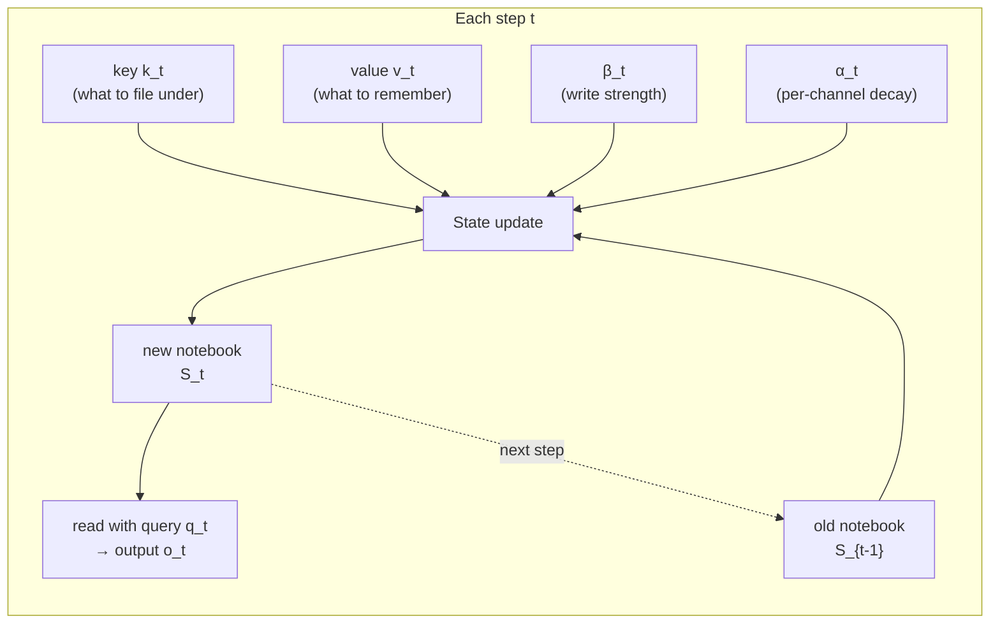
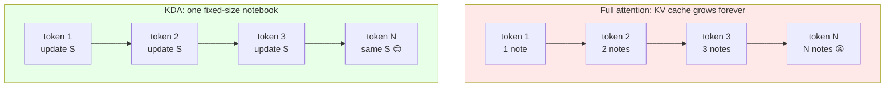
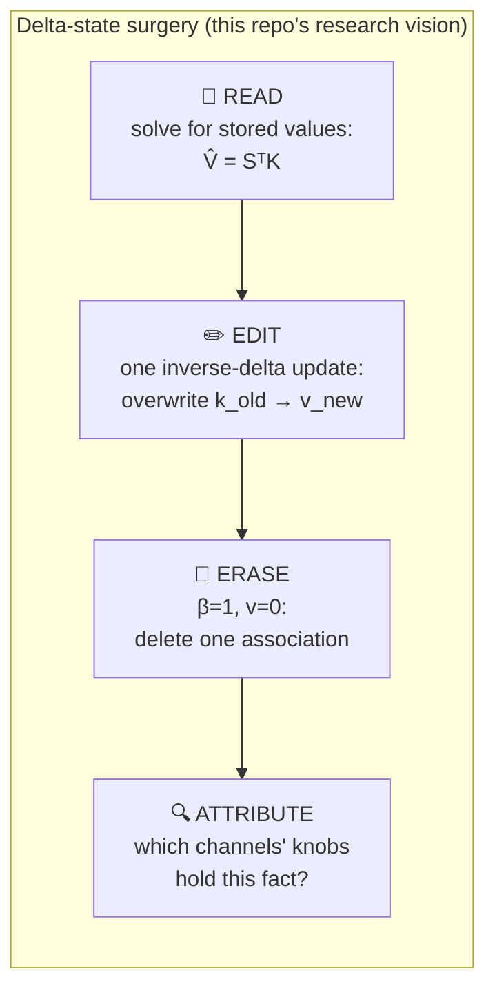

# Extended Introduction: KDA for Complete Beginners

This version assumes **zero background**. No linear algebra, no deep learning.
We use pictures, analogies, and plain sentences. If you already know transformers,
read `docs/INTRODUCTION.md` instead.

## 1. The problem: re-reading the whole bookshelf

Imagine you're writing a story, one word at a time. To pick each next word, a
**full-attention transformer** does something exhausting: it **re-reads every
single previous word of the story**, compares each one to the current situation,
and decides which past words matter right now.

> **Analogy: full attention is like re-reading the entire bookshelf every time
> you want to write one more word.**

Two consequences:

1. **Slow as the story grows.** Ten times more story means one hundred times more
   re-reading (every word is compared against every word — the comparisons grow
   with the *square* of the length).
2. **An ever-growing backpack.** While writing, the model must carry around a
   little note (called a *key* and a *value*) for **every word it has ever
   written**. This backpack is the **KV cache**, and for million-word stories it
   becomes the biggest memory cost in the whole system.

## 2. The idea: keep a notebook instead

What if, instead of re-reading everything, the model kept a single **notebook**?
Each time it reads a word, it jots something down. When it needs to write the
next word, it just consults the notebook — which never grows, no matter how long
the story gets.

This notebook is the **state**, called `S`. It's just a fixed-size grid of
numbers. Reading the story = updating the grid. Writing the next word = reading
from the grid. This family of models is called **linear attention** or
**recurrent** models, because the same update repeats every step [3, 4].



The catch: a fixed-size notebook can hold only so much. The whole research
field is about **what to write, what to erase, and what to keep**.

## 3. The delta rule: a correction, not just a note

The simplest notebook update is additive: new fact? Add it. But if you already
wrote "the capital of France is Berlin" (wrong) and later learn better, adding
"the capital of France is Paris" leaves *both* in the notebook, and they blur
together.

The **delta rule** is a correction rule [3]: before writing a new fact under a
heading, **first erase whatever was written under that heading**, then write the
new one. Like a pencil-and-eraser notebook rather than a pen-only one.

> **Analogy: KDA keeps a notebook that it updates with a correction rule —
> erase the old line under this heading, then write the new line.**

In symbols, the update is:

```
S_t = (I − β_t k_t k_tᵀ) S_{t−1}  +  β_t k_t v_tᵀ
       └─ erase old entry ──┘      └── write new ──┘
```

This makes the notebook a genuine **associative memory**: a lookup table from
keys (headings) to values (facts). Researchers proved this update is literally a
small step of least-squares regression — the same math used to fit a line to
data points [13].

## 4. The per-channel gate: a brightness knob per line

Earlier correction-notebook models (Gated DeltaNet [2]) had one more trick: a
**global dimmer switch** `α`. Each step, the whole notebook fades a little —
old, unrefreshed notes slowly disappear to make room.

KDA's upgrade: instead of one dimmer for the whole notebook, there is **a
separate brightness knob for every line of the notebook** [1]. Some lines are
kept bright for a million words (long-term facts); others fade almost instantly
(temporary scratch space). The model turns each knob independently at every step.

> **Analogy: the per-channel gate is a separate brightness knob for each line
> of the notebook.**

```
Gated DeltaNet:  S_t = α_t (I − β_t k_t k_tᵀ) S_{t−1} + β_t k_t v_tᵀ   (one knob)
KDA:             S_t = (I − β_t k_t k_tᵀ) Diag(α_t) S_{t−1} + β_t k_t v_tᵀ  (knob per channel)
```

## 5. Why this is a big deal

Because the notebook never grows, KDA-style models avoid the KV-cache backpack.
The Kimi Linear paper reports [1]:

- **75% less KV-cache memory** on long contexts,
- **6× faster decoding** at 1,000,000-token contexts,
- and the **first linear-attention model to beat full attention** in a fair
  head-to-head comparison — the notebook finally outperforms re-reading the shelf.



## 6. The vision: surgery on the notebook

Here's where it gets really interesting. In ordinary neural networks, "knowledge"
is smeared across billions of connection strengths, and changing one fact
requires expensive retraining tricks (like ROME for GPT models [14], later ported
to Mamba's *weights* [15]).

But KDA's notebook is different: it's an **exactly interpretable data
structure**. A fact stored under key `k` can be read back by simple arithmetic,
and — thanks to the delta rule — **overwritten or erased with one closed-form
update, zero retraining**.



That research program — *delta-state surgery* — is described in
`docs/ROADMAP.md` (Phase 3). To our knowledge no published work has done this on
a delta-rule recurrent *state*: prior editing work modified model **weights** [14, 15].

## 7. Math in one plain sentence each

- **Outer product** (`k vᵀ`): a way to turn two lists of numbers into a grid,
  where the cell at row *i*, column *j* is the product of item *i* of the first
  list and item *j* of the second — it's how you "file" a value under a key.
  ▶️ [3Blue1Brown: Linear algebra series](https://www.3blue1brown.com/topics/linear-algebra)
- **Diagonal matrix** (`Diag(α)`): a grid that is all zeros except down the
  diagonal, so multiplying by it just scales each row by its own private
  number — our "brightness knob per line."
  ▶️ [Khan Academy: Matrices](https://www.khanacademy.org/math/algebra-home/alg-matrices)
- **Matrix inverse / pseudoinverse**: the "undo button" for a matrix — it
  answers "what input would have produced this output?", even when an exact
  inverse doesn't exist.
  ▶️ [StatQuest: Matrix inverse](https://statquest.org/) ·
  [3Blue1Brown: Inverse matrices](https://www.3blue1brown.com/lessons/inverse-matrices)
- **Cosine similarity**: a measure of how much two arrows point in the same
  direction (1 = identical direction, 0 = unrelated, −1 = opposite), used to
  ask "how similar are these two keys?"
  ▶️ [StatQuest: Cosine similarity](https://statquest.org/)

## 8. What this repo is (and isn't)

This repository is a **teaching implementation**: small, commented, and tested
on random synthetic data. It is *not* the fast production version — that's the
[FLA library](https://github.com/fla-org/flash-linear-attention). Use this repo
to *understand* KDA, and to join the state-surgery experiments in
`docs/ROADMAP.md`.

## References

1. Kimi Team. **Kimi Linear: An Expressive, Efficient Attention Architecture.** 2025. arXiv:2510.26692.
2. Yang, Kautz, Hatamizadeh. **Gated Delta Networks.** ICLR 2025. arXiv:2412.06464.
3. Schlag, Irie, Schmidhuber. **Linear Transformers Are Secretly Fast Weight Programmers.** ICML 2021. arXiv:2102.11174.
4. Katharopoulos et al. **Transformers are RNNs.** ICML 2020. arXiv:2006.16236.
5. Choromanski et al. **Rethinking Attention with Performers.** ICLR 2021. arXiv:2009.14794.
7. Gu, Dao. **Mamba.** COLM 2024. arXiv:2312.00752.
8. Dao, Gu. **Mamba-2 / State Space Duality.** ICML 2024. arXiv:2405.21060.
9. Peng et al. **RWKV.** EMNLP 2023 Findings. arXiv:2305.13048.
10. Sun et al. **RetNet.** 2023. arXiv:2307.08621.
11. Yang et al. **Gated Linear Attention.** ICML 2024. arXiv:2312.06635.
13. Wang, Shi, Fox. **Test-Time Regression.** JMLR 2025. arXiv:2501.12352.
14. Meng, Bau et al. **Locating and Editing Factual Associations in GPT (ROME).** NeurIPS 2022. arXiv:2202.05262.
15. Sharma, Atkinson, Bau. **Locating and Editing Factual Associations in Mamba.** NeurIPS 2024. arXiv:2404.03646.
16. Hsieh et al. **RULER.** COLM 2024. arXiv:2404.06654.
