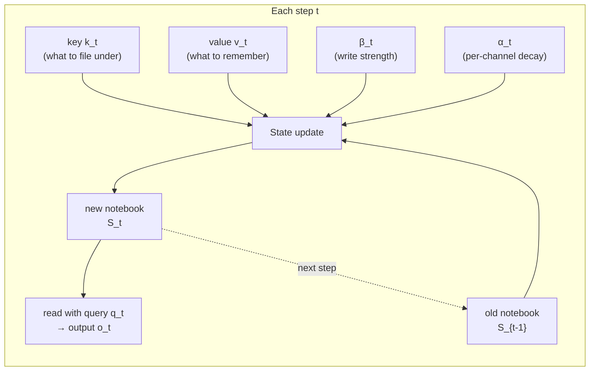
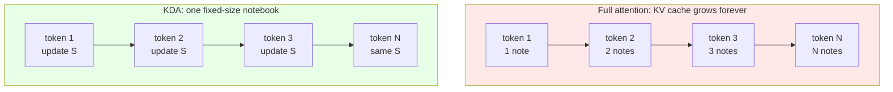
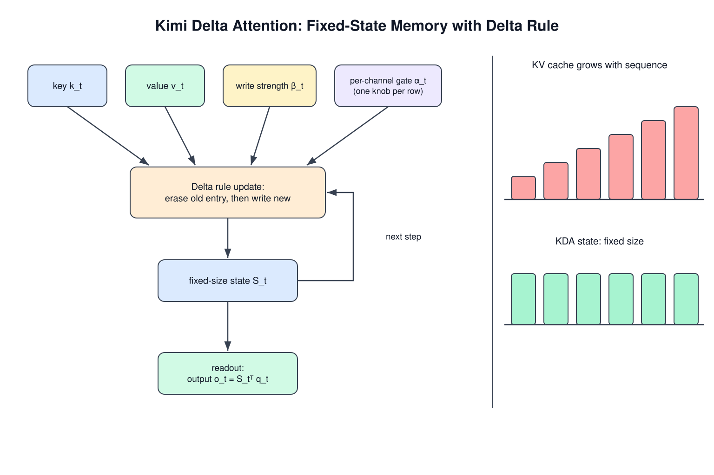
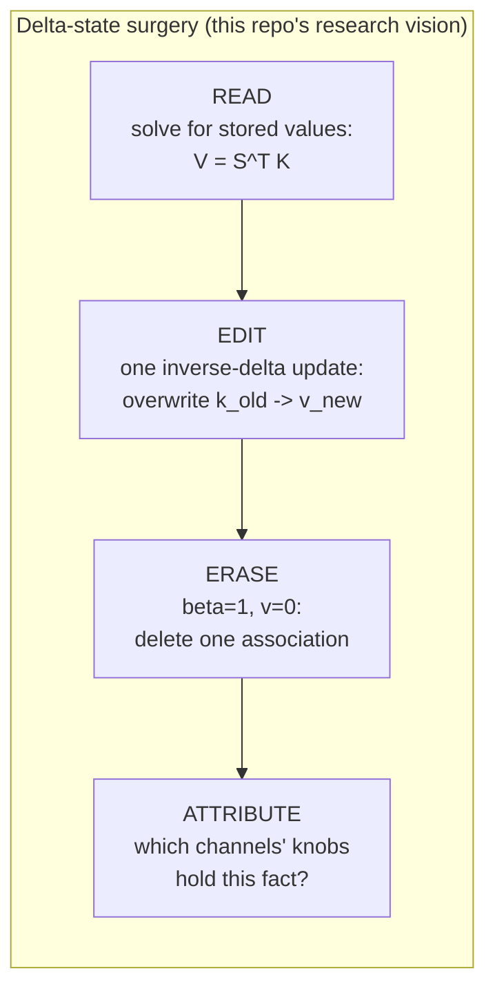

# Extended Introduction: KDA for Complete Beginners

This version assumes **zero background** — no linear algebra, no deep
learning, no math beyond arithmetic. Every technical idea is introduced the
same way: **first a tiny example with real numbers you can check by hand,
then the intuition, then the notation** as shorthand for the procedure you
just saw. If you already know transformers, read `docs/INTRODUCTION.md`
instead.

## 1. The problem: re-reading the whole bookshelf

Imagine you're writing a story, one word at a time. To pick each next word, a
**full-attention transformer** does something exhausting: it **re-reads every
single previous word of the story**, compares each one to the current
situation, and decides which past words matter right now.

*Tiny example.* With a 10-word story, picking the next word takes up to
10 × 10 = **100** comparisons. With 1,000 words it takes 1,000 × 1,000 =
**1,000,000**. The story got 100× longer; the work got 10,000× bigger. That
blow-up — work growing with the *square* of the length — is the "quadratic
cost" people complain about.

Worse, while writing, the model must carry around a little note (a *key* and
a *value*) for **every word it has ever written**. This backpack is the
**KV cache**, and for million-word stories it becomes the biggest memory cost
in the whole system.

## 2. The idea: keep a notebook instead

What if, instead of re-reading everything, the model kept a single
**notebook**? Each time it reads a word, it jots something down. When it
needs to write the next word, it consults the notebook — which never grows,
no matter how long the story gets.

This notebook is the **state**, called `S`: a fixed-size grid of numbers.
Reading the story = updating the grid; writing the next word = reading from
the grid. This family is called **linear attention** or **recurrent** models,
because the same update repeats every step [3, 4].



The catch: a fixed-size notebook can hold only so much. The whole research
field is about **what to write, what to erase, and what to keep**.

## 3. The delta rule: a correction, not just a note

The simplest notebook update is additive: new fact? Add it. But if you
already wrote "the capital of France is Berlin" (wrong) and later learn
better, adding "the capital of France is Paris" leaves *both* in the
notebook, and they blur together.

The **delta rule** is a correction rule [3]: before writing a new fact under
a heading, **first erase whatever was written under that heading**, then
write the new one.

*Tiny example with real numbers.* Say headings and facts are single numbers
and the notebook `S` has two slots. "File fact `v` under heading `k`" means:
make a grid whose row-i, column-j cell is (item i of `k`) × (item j of `v`)
— that product-grid is called an **outer product**, written `k vᵀ`.

- Start: `S = [[0], [0]]` (empty notebook with 2 slots).
- Step 1: heading `k = (1, 0)`, fact `v = (5)`, write strength `β = 1`.
  The delta rule says: erase whatever `S` currently says under `k`, then
  write. `S` was empty, so nothing to erase:
  `S = [[5], [0]]` — "under heading (1,0): the fact is 5."
- Step 2: same heading `k = (1, 0)`, corrected fact `v = (7)`, `β = 1`.
  First erase the old entry (the 5), then write the new one:
  `S = [[7], [0]]`. No blur: the notebook now holds only the correction.

Reading is just as concrete: to ask "what fact is stored under heading
`q = (1, 0)`?", multiply — row 1 of `S` — and read off **7**. That's the
readout `o = Sᵀq`.

The full update in symbols is exactly the erase-then-write you just did:

```
S_t = (I − β_t k_t k_tᵀ) S_{t−1}  +  β_t k_t v_tᵀ
       └─ erase old entry ──┘      └── write new ──┘
```

The first term rescales the old notebook so the old entry under `k_t` is
removed; the second writes the new fact. This makes the notebook a genuine
**associative memory**: a lookup table from keys (headings) to values
(facts). Researchers proved this update is literally a small step of
least-squares regression — the same math used to fit a line to data points
[13].

## 4. The per-channel gate: a brightness knob per line

Earlier correction-notebook models (Gated DeltaNet [2]) added a **global
dimmer switch** `α`: each step, the whole notebook fades a little, so old,
unrefreshed notes slowly disappear.

*Tiny example.* With `α = 0.9` and notebook `S = [[7], [3]]`, one fade gives
`[[6.3], [2.7]]` — both rows dimmed equally.

KDA's upgrade: **a separate brightness knob for every line** [1]. *Tiny
example:* with knobs `α = (0.9, 0.5)`, the same notebook fades to
`[[6.3], [1.5]]` — row 1 barely fades (long-term fact), row 2 halves
(scratch space). That per-row scaling is all that `Diag(α)` means: a grid
that is zero everywhere except the diagonal, so multiplying by it scales
each row by its own private number.

```
Gated DeltaNet:  S_t = α_t (I − β_t k_t k_tᵀ) S_{t−1} + β_t k_t v_tᵀ   (one knob)
KDA:             S_t = (I − β_t k_t k_tᵀ) Diag(α_t) S_{t−1} + β_t k_t v_tᵀ  (knob per channel)
```

Each **channel** (row) of the state now has its own decay rate, decided per
token by the network: a *spectrum* of timescales instead of one global one,
under the same delta-rule error correction.

## 5. Why this is a big deal

Because the notebook never grows, KDA-style models avoid the KV-cache
backpack. The Kimi Linear paper reports [1]:

- **75% less KV-cache memory** on long contexts,
- **6× faster decoding** at 1,000,000-token contexts,
- and the **first linear-attention model to beat full attention** in a fair
  head-to-head comparison — the notebook finally outperforms re-reading the
  shelf.





## 6. The vision: surgery on the notebook

In ordinary neural networks, "knowledge" is smeared across billions of
connection strengths, and changing one fact requires expensive retraining
tricks (like ROME for GPT models [14], later ported to Mamba's *weights*
[15]).

KDA's notebook is different: it's an **interpretable data structure**. A fact
stored under key `k` can be read back by the multiply-and-read procedure from
Section 3, and — thanks to the delta rule — **overwritten or erased with one
closed-form update, zero retraining**. (Sometimes reading requires solving a
small linear system — "what inputs would have produced this grid?" — the
**pseudoinverse** is just the general-purpose "undo button" for that
question, even when an exact undo doesn't exist.)



That research program — *delta-state surgery* — is described in
`docs/ROADMAP.md` (Phase 3). To our knowledge no published work has done
this on a delta-rule recurrent *state*: prior editing work modified model
**weights** [14, 15].

## 7. The math toolkit, recap (each already used above)

- **Outer product** (`k vᵀ`): turn two lists into a grid where cell (i, j) =
  item i of the first list × item j of the second — how you "file" a value
  under a key. You computed one in Section 3.
- **Diagonal matrix** (`Diag(α)`): all zeros except the diagonal; multiplying
  by it scales each row by its own number — the "brightness knob per line"
  from Section 4.
- **Matrix inverse / pseudoinverse**: the "undo button" for a matrix,
  answering "what input produced this output?", even approximately.
- **Cosine similarity**: how much two arrows point the same way (1 =
  identical, 0 = unrelated, −1 = opposite); computed by multiplying matching
  entries, adding, and dividing by the arrow lengths — used to ask "how
  similar are these two keys?"

## 8. What this repo is (and isn't)

This repository is a **teaching implementation**: small, commented, and
tested on random synthetic data. It is *not* the fast production version —
that's the [FLA library](https://github.com/fla-org/flash-linear-attention).
Use this repo to *understand* KDA, and to join the state-surgery experiments
in `docs/ROADMAP.md`.

## References

1. Kimi Team. **Kimi Linear: An Expressive, Efficient Attention Architecture.** 2025. arXiv:2510.26692.
2. Yang, Kautz, Hatamizadeh. **Gated Delta Networks.** ICLR 2025. arXiv:2412.06464.
3. Schlag, Irie, Schmidhuber. **Linear Transformers Are Secretly Fast Weight Programmers.** ICML 2021. arXiv:2102.11174.
4. Katharopoulos et al. **Transformers are RNNs.** ICML 2020. arXiv:2006.16236.
5. Choromanski et al. **Rethinking Attention with Performers.** ICLR 2021. arXiv:2009.14794.
7. Gu, Dao. **Mamba.** COLM 2024. arXiv:2312.00752.
8. Dao, Gu. **Mamba-2 / State Space Duality.** ICML 2024. arXiv:2405.21060.
9. Peng et al. **RWKV.** EMNLP 2023 Findings. arXiv:2305.13048.
10. Sun et al. **RetNet.** 2023. arXiv:2307.08621.
11. Yang et al. **Gated Linear Attention.** ICML 2024. arXiv:2312.06635.
13. Wang, Shi, Fox. **Test-Time Regression.** JMLR 2025. arXiv:2501.12352.
14. Meng, Bau et al. **Locating and Editing Factual Associations in GPT (ROME).** NeurIPS 2022. arXiv:2202.05262.
15. Sharma, Atkinson, Bau. **Locating and Editing Factual Associations in Mamba.** NeurIPS 2024. arXiv:2404.03646.
16. Hsieh et al. **RULER.** COLM 2024. arXiv:2404.06654.
