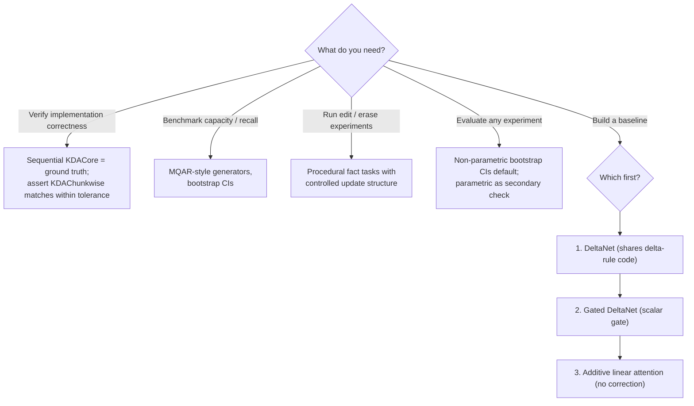

# Methods: Done, Intended, and Undecided

This file is the engineering ledger: what exists, what is planned (and why),
and which design choices are still open with their selection rules.

## Done

| Component | Location | Notes |
|---|---|---|
| KDA recurrent core (`KDACore`) | `kda/core.py` | Sequential state update `S_t = (I − β_t k_t k_tᵀ) Diag(α_t) S_{t−1} + β_t k_t v_tᵀ`, output `o_t = S_tᵀ q_t`. Single-head, clarity-first. |
| Chunkwise variant (`KDAChunkwise`) | `kda/core.py` | Simplified chunked processing that delegates intra-chunk work to `KDACore`; padding handled. Educational, not the paper's DPLR kernel. |
| KDA attention layer (`KimiDeltaAttention`) | `kda/attention.py` | Multi-head wrapper: projections for q/k/v/α/β, per-head `KDACore`, output projection. Standard `nn.Module` interface. |
| Utilities | `kda/utils.py` | Helper functions used by the core and tests. |
| Synthetic unit tests | `tests/test_kda_core.py`, `tests/test_attention.py` | Random-data shape/numerics validation (see `docs/TESTING.md`). |
| Usage / benchmark examples | `examples/basic_usage.py`, `examples/benchmark.py` | Minimal forward-pass demo and a simple benchmark script. |
| Architecture & testing docs | `docs/ARCHITECTURE.md`, `docs/TESTING.md` | Existing deep-dive documentation. |

## Intended

Roadmap modules (see `docs/ROADMAP.md` and the GitHub issue backlog for sizes
and dependencies):

1. **MQAR-style synthetic key→value recall task generators** (`data/`, planned).
   *Rationale:* current tests verify numerics only; we need behavioral evidence
   that trained KDA uses `S` as an associative memory before any state-surgery
   experiment is meaningful.
   *Failure mode:* task too easy → all models score 100%, no discriminative
   power; key distribution poorly chosen → recall succeeds without a clean
   key→value mapping, invalidating later readout probes.
2. **Train small KDA on the recall suite + capacity curve.**
   *Rationale:* establishes how many pairs a given state size holds — the
   x-axis of every Phase 3 curve.
   *Failure mode:* training instability or under-capacity models misread as a
   property of the architecture rather than the training setup.
3. **Baselines: additive linear attention, DeltaNet, Gated DeltaNet.**
   *Rationale:* the KDA-specific contribution (per-channel gating) is only
   measurable against ablated siblings [2, 3].
   *Failure mode:* baseline implementations subtly stronger/weaker than
   canonical versions, contaminating comparisons.
4. **State-capture utilities** (expose/serialize `S_t`, `α_t`, `β_t`).
   *Rationale:* every Phase 2/3 tool consumes trajectories of the state.
   *Failure mode:* capture overhead changes numerics or silently records
   post-norm copies instead of the true state.
5. **Least-squares readout probe** (`V̂ = SᵀK`, key recovery via pseudoinverse).
   *Rationale:* validates the "state is a literal associative memory" premise
   [13] before attempting edits.
   *Failure mode:* keys highly correlated → pseudoinverse ill-conditioned,
   readout fidelity collapses for non-architectural reasons.
6. **Targeted-edit / erase operators** (closed-form inverse-delta updates).
   *Rationale:* the novel research core — "ROME-for-free at the state level."
   *Failure mode:* state entanglement: overlapping keys bleed, edits leak to
   neighbors (measurable, and itself a result).
7. **Channel-gating logger + attribution experiments.**
   *Rationale:* the KDA-specific mechanism (per-channel `α`) should produce
   per-channel fact localization, unlike scalar-gated models.
   *Failure mode:* attribution diffuse across channels → no selective ablation
   effect; would be reported as an honest negative.
8. **Results report against pre-registered metrics.**
   *Rationale:* metrics are fixed before experiments run (see ROADMAP Phase 3);
   negative results are reported, not suppressed.

## Undecided choices

### 1. Chunkwise vs recurrent reference implementation for tests
- **Option A — sequential `KDACore` as the only reference:** simplest, already
  trusted; but slow for long sequences and doesn't exercise `KDAChunkwise`.
- **Option B — both, cross-validated:** use `KDACore` as ground truth and
  assert `KDAChunkwise` matches it within tolerance across chunk sizes.
- **Selection rule:** adopt **B** for correctness testing (chunkwise must match
  recurrent), while Phase 1+ training experiments may use whichever is faster
  at the needed sequence length. If the two ever disagree beyond float32
  tolerance, the discrepancy blocks merges until resolved.

### 2. Synthetic recall task family
- **Option A — MQAR-style** (multi-query associative recall): random key–value
  pairs embedded in a filler sequence, multiple queries per sequence; standard
  in the linear-attention literature.
- **Option B — procedural "fact" tasks:** structured mini-worlds (entity →
  attribute bindings with distractors and updates); closer to the editing
  semantics Phase 3 needs (overwrite, erase).
- **Selection rule:** use **MQAR-style** for capacity/recall benchmarking
  (comparable to prior work), and **procedural facts** for the edit/erase
  experiments (need controlled update structure). Decision gate: if MQAR
  capacity curves already saturate discriminability between baselines, skip
  procedural benchmarking except where editing requires it.

### 3. Edit-evaluation statistics
- **Option A — parametric:** t-tests / ANOVA on recall deltas; simple, familiar,
  but assumes near-normal score distributions.
- **Option B — non-parametric:** bootstrap confidence intervals and
  permutation tests on recall deltas; robust for bounded, skewed accuracy data.
- **Selection rule:** default to **non-parametric bootstrap CIs** (accuracy
  deltas are bounded and often skewed); report parametric tests as a secondary
  check. If both disagree materially, trust the non-parametric result and flag
  it in the report.

### 4. Comparison baselines — implementation order
- **Options:** pure additive linear attention [4] / DeltaNet [3] / Gated
  DeltaNet [2].
- **Selection rule:** implement **DeltaNet first** (it is KDA minus gating —
  shares the delta-rule code path, minimal new code, and isolates the gating
  contribution), then **Gated DeltaNet** (scalar gate — isolates the
  *per-channel* contribution), then **additive linear attention** (no delta
  rule — isolates the error-correction contribution). This ordering front-loads
  code reuse and runs ablations in decreasing order of architectural distance
  from KDA.

## Decision flowchart

## References

2. Yang, Kautz, Hatamizadeh. **Gated Delta Networks.** ICLR 2025. arXiv:2412.06464.
3. Schlag, Irie, Schmidhuber. **Linear Transformers Are Secretly Fast Weight Programmers.** ICML 2021. arXiv:2102.11174.
4. Katharopoulos et al. **Transformers are RNNs.** ICML 2020. arXiv:2006.16236.
13. Wang, Shi, Fox. **Test-Time Regression.** JMLR 2025. arXiv:2501.12352.
