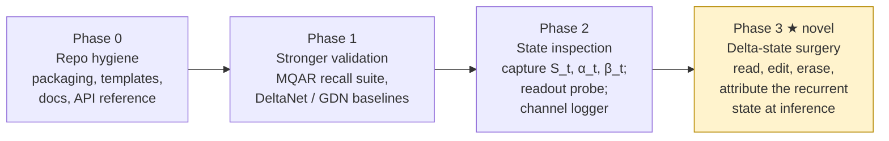

# Roadmap

The backlog lives as GitHub issues; `docs/PROJECT.md` is the in-repo board with
live issue numbers. This file explains the *why*.

## Phase 0 — Repo hygiene

Contribution-ready scaffolding: pyproject packaging, issue/PR templates,
`CONTRIBUTING.md`, docs set, API reference, a commented memory/latency
walkthrough example. Low risk, unblocks outside contributors.

## Phase 1 — Stronger validation

Current tests check shapes and numerics on random data. Phase 1 asks a
behavioral question: **does a trained KDA actually use `S` as an associative
memory, and how much can it hold?**

- MQAR-style synthetic key→value recall suite (versioned data).
- Small KDA trained on the suite; capacity curve = #pairs vs recall accuracy.
- Baselines: additive linear attention [4], DeltaNet [3], Gated DeltaNet [2] —
  an ablation ladder isolating (i) the delta rule and (ii) per-channel gating.

Exit criterion: capacity curves for all four architectures on the same suite,
with bootstrap confidence intervals.

## Phase 2 — State inspection tooling

Everything in Phase 3 consumes state trajectories. Phase 2 builds the
instrumentation:

- **State capture:** expose/serialize `S_t`, `α_t`, `β_t` during a forward
  pass, with tests proving captured values match a manual re-run.
- **Least-squares readout probe:** recover stored values via `V̂ = SᵀK` and
  keys via the pseudoinverse of `S`; fidelity metrics (cosine similarity of
  recovered vs true). This directly tests the test-time-regression view that
  `S` is an online least-squares associative memory [13].
- **Channel-gating logger:** per-channel `α` statistics across fact types.

Exit criterion: on a trained small KDA, readout fidelity significantly above
chance — or a documented negative result that gates (and reshapes) Phase 3.

## Phase 3 — Novel research: Delta-state surgery

**Reading and editing KDA's associative memory at inference time.**

### Gap analysis

Model editing exists (ROME for GPT [14]) and was ported to Mamba — but at the
**weight** level: Sharma, Atkinson, and Bau (NeurIPS 2024) edit Mamba's
parameters, never touching the recurrent state [15]. Separately, test-time
regression gives the linear-attention state precise semantics — it *is* an
online least-squares solution mapping keys to values [13]. But no published
work:

1. reads stored associations out of a delta-rule recurrent **state**,
2. performs targeted inference-time **edits** on that state via inverse delta
   updates, or
3. does per-channel gating **attribution** in KDA/Gated DeltaNet.

The delta rule makes this unusually tractable: because the state is a literal
least-squares associative memory, edits are **closed-form** — no gradient
steps, exact specificity control via `β` and `α`. Informally:
**"ROME-for-free at the state level."**

> The delta-rule state is the only component in modern LLMs that is both a
> trained representation and an exactly interpretable data structure — this
> project exploits that duality.

### Experiment plan

1. **Readout probe.** Train a small KDA on synthetic key→value recall
   (MQAR-style). Recover stored associations by least squares (`V̂ = SᵀK`);
   recover keys via SVD/pseudoinverse of `S`. Measure fidelity.
2. **Targeted edit.** After ingestion, apply one inverse-delta update to
   overwrite a single association (`k_old → v_new`). Measure recall accuracy of
   the edited pair vs unedited pairs (specificity).
3. **Erase.** Set `β=1, v=0` (or force per-channel `α` decay) to suppress one
   association; measure interference vs key similarity (crosstalk structure).
4. **Channel attribution.** Log per-channel `α_t` while ingesting different
   fact types; ablate top-attributed channels and measure selective recall
   loss vs random ablation — the KDA-specific contribution over Gated
   DeltaNet.
5. **Capacity/interference curve.** #stored pairs vs edit success for additive
   linear attention, DeltaNet, Gated DeltaNet, and KDA.

### Metrics (pre-registered)

- Post-edit recall accuracy of the target pair.
- Interference rate: recall drop on unedited pairs, stratified by key cosine
  similarity.
- Edit locality: `‖Δoutput‖` on unrelated queries.
- Readout fidelity: cosine similarity of recovered vs true values.
- Channel-attribution fidelity: selective recall loss (targeted vs random
  ablation).
- All reported as functions of memory load and gate statistics, with bootstrap
  confidence intervals (see `docs/METHODS.md`).

### Risks

- **State entanglement:** overlapping keys bleed into each other; edits may not
  be local. Mitigation: it is measurable (interference vs key similarity is
  itself an interesting curve).
- **Trained model may not use `S` as a clean associative memory.** Step 1
  tests this first; a failure still documents the gap between the idealized
  and the trained dynamics.
- **Synthetic-to-real generalization unproven.** Scope is explicitly synthetic;
  claims will not be extrapolated.
- **Channel attribution may be diffuse.** Would be reported as an honest
  negative.

## References

2. Yang, Kautz, Hatamizadeh. **Gated Delta Networks.** ICLR 2025. arXiv:2412.06464.
3. Schlag, Irie, Schmidhuber. **Linear Transformers Are Secretly Fast Weight Programmers.** ICML 2021. arXiv:2102.11174.
4. Katharopoulos et al. **Transformers are RNNs.** ICML 2020. arXiv:2006.16236.
13. Wang, Shi, Fox. **Test-Time Regression.** JMLR 2025. arXiv:2501.12352.
14. Meng, Bau et al. **Locating and Editing Factual Associations in GPT (ROME).** NeurIPS 2022. arXiv:2202.05262.
15. Sharma, Atkinson, Bau. **Locating and Editing Factual Associations in Mamba.** NeurIPS 2024. arXiv:2404.03646.
